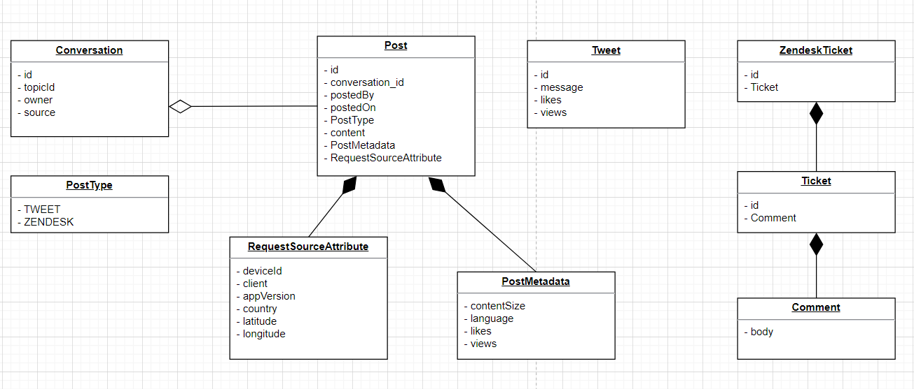
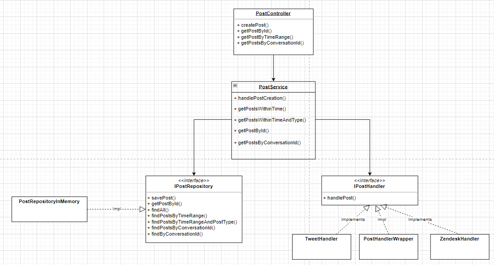

# Feedback Ingestion Service

Feedback ingestion from various sources, currently supports tweets and Zendesk support tickets

## API Reference

[Postman Collection](https://api.postman.com/collections/17761493-8fda7929-452d-4fe1-bfdc-7049dd651d78?access_key=PMAT-01HQRPM8F52AEYHQ09DDMVG2AW)


#### Get Posts within time range

```http
  GET /posts
```

| Parameter | Type     | Description                |
| :-------- | :------- | :------------------------- |
| `startTime` | `string` | **Optional**. Specifies start time for posts. If not specified, fetches all the posts from beginning of time |
| `endTime` | `string` | **Optional**. Specifies end time for posts. If not specified, fetches all the posts till end of time |
| `postType` | `string` | **Optional**. Possible values are `TWEET` or `ZENDESK` |

##### Sample Req - Res:

```
curl --location 'localhost:8080/conversations/123456789'
```

```
{
    "conversation": {
        "conversationId": "123456789",
        "topic": "Random message 17518",
        "owner": "Bob",
        "postType": "TWEET"
    },
    "posts": [
        {
            "id": "15194",
            "conversationId": "123456789",
            "postedBy": "Bob",
            "createdAt": "2024-02-26T07:46:57",
            "postType": "TWEET",
            "content": "Random message 17518",
            "contentMetadata": {
                "contentSize": 20,
                "language": "EN-US",
                "likes": 13,
                "views": 709
            },
            "requestSourceAttribute": {
                "deviceId": "APPLE",
                "client": "client123",
                "appVersion": "10.3.0",
                "country": "UK",
                "latitude": 0.0,
                "longitude": 0.0
            }
        },
        {
            "id": "6740",
            "conversationId": "123456789",
            "postedBy": "John",
            "createdAt": "2024-02-25T14:11:11",
            "postType": "TWEET",
            "content": "Random message 14775",
            "contentMetadata": {
                "contentSize": 20,
                "language": "EN-US",
                "likes": 62,
                "views": 242
            },
            "requestSourceAttribute": {
                "deviceId": "APPLE",
                "client": "client789",
                "appVersion": "10.4.0",
                "country": "India",
                "latitude": 0.0,
                "longitude": 0.0
            }
        }
    ]
}
```

#### Get A particular post

```http
  GET /posts/${id}
```

| Parameter | Type     | Description                       |
| :-------- | :------- | :-------------------------------- |
| `id`      | `string` | **Required**. Id of post to fetch |

##### Sample Req - Res:

```
curl --location 'localhost:8080/posts/29363'

```

```
{
    "id": "29363",
    "conversationId": "123456789",
    "postedBy": "Bob",
    "createdAt": "2024-02-25T02:21:03",
    "postType": "TWEET",
    "content": "Random message 31559",
    "contentMetadata": {
        "contentSize": 20,
        "language": "EN-US",
        "likes": 42,
        "views": 171
    },
    "requestSourceAttribute": {
        "deviceId": "GOOGLE",
        "client": "client123",
        "appVersion": "10.4.0",
        "country": "UK",
        "latitude": 0.0,
        "longitude": 0.0
    }
}
```

#### Make a POST

```http
  POST /posts/create
```

| field | Type     | Description                       |
| :-------- | :------- | :-------------------------------- |
| `conversationId`      | `string` | **Optional**. If a post is referring to a previous conversation (comment to a particular post) , conversationId will just create a reference to it |
| `postedBy`      | `string` | Person who posted |
| `postType`      | `string` | whether `TWEET` or `ZENDESK` |
| `content`      | `string` | contains the main part, specific to client |
| `createdAt`      | `string` | time of post creation |
| `requestSourceAttribute`      | `json` | contains source details |

##### Sample Request for tweet:

```
curl --location 'localhost:8080/posts/create' \
--header 'Content-Type: application/json' \
--data '{
    "conversationId": "123456789",
    "postedBy" : "Ayush",
    "postType" : "TWEET",
    "content":"{\"tweet_id\": \"123456789\",\"message\": \"Hello, Twitter!\",\"likes\": 10,\"views\": 100}",
    "createdAt": "2024-02-28T15:30:00",
    "requestSourceAttribute":{
        "deviceId":"XIAOMI",
        "client":"client123",
        "appVersion":"10.2.0",
        "country": "India",
        "latitude":"72.12",
        "longitude":"64.57"
    }
}
'
```
###### Sample Request for ZENDESK
```
curl --location 'localhost:8080/posts/create' \
--header 'Content-Type: application/json' \
--data '{
    "conversationId": "67801234",
    
    "postedBy" : "Ayush",
    "postType" : "ZENDESK",
    "content":"{\"ticket_id\":\"123456\",\"ticket\":{\"subject\":\"Ticket subject\",\"comment\":{\"body\":\"Comment body\"}}}",
    "createdAt": "2024-02-28T15:30:00",
    "requestSourceAttribute":{
        "deviceId":"XIAOMI",
        "client":"client123",
        "appVersion":"10.2.0",
        "country": "India",
        "latitude":"72.12",
        "longitude":"64.57"
    }
}
'
```

Notice that the content is different in both the requests.

Sample response
```
{
    "id": "123456",
    "conversationId": "123456789",
    "postedBy": "Ayush",
    "createdAt": "2024-02-28T15:30:00",
    "postType": "ZENDESK",
    "content": "Comment body",
    "contentMetadata": {
        "contentSize": 12,
        "language": "EN-US",
        "likes": 0,
        "views": 0
    },
    "requestSourceAttribute": {
        "deviceId": "XIAOMI",
        "client": "client123",
        "appVersion": "10.2.0",
        "country": "India",
        "latitude": 72.12,
        "longitude": 64.57
    }
}
```


### Models



### Dataflow

For the dataflow, the 
* PostController is the place where all the APIs reside, any external call is made through this
* PostService - it calls a factory of TweetHandler/ZendeskHandler based on post Type
* PostRepository - It is an interface which stores the data for the requests




### How to run:

* Make sure spring boot application is running
  
* Inside `src/main/resources/scripts` , there are two scripts for twitter data setup and zendesk setup

* Run the above two using:

```aidl
./tweetdata_setup.sh
./zendesk_setup.sh

```
* The above two will create data for testing. Now you can independently hit the curls to verify
